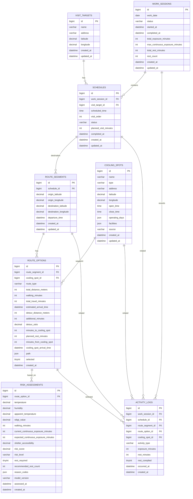

# 쉼표 MVP 데이터베이스 ERD

## 1. DB 기준

- DBMS: MySQL 8.x
- Storage Engine: InnoDB
- Character Set: `utf8mb4`
- 날짜·시간: `DATETIME`
- JSON 데이터: `JSON`
- Boolean 데이터: `TINYINT(1)` (`0`: false, `1`: true)
- PK: `BIGINT AUTO_INCREMENT PRIMARY KEY`
- FK: 참조 대상 PK와 동일한 `BIGINT`

### 시간 규칙

DB의 모든 `DATETIME`은 UTC로 저장한다. API는 ISO 8601 형식으로 반환하고, 사용자 화면에는 `Asia/Seoul` 시간대로 표시한다.

```text
DB 저장:  2026-08-17 05:30:00       # UTC
API 응답: 2026-08-17T14:30:00+09:00
```

## 2. ERD



## 3. 테이블 목록

| 테이블 | 역할 |
| --- | --- |
| `visit_targets` | 방문 대상자 mock pool |
| `work_sessions` | 하루 업무 단위 및 최종 집계 |
| `schedules` | 업무 세션의 방문 일정 |
| `route_segments` | 방문지까지의 이동 계획 단위 |
| `route_options` | 일반경로 및 안전경로 후보 |
| `risk_assessments` | 특정 경로 후보 기준 AI 위험판단 결과 |
| `cooling_spots` | 공공 및 기업 쿨링스팟 |
| `activity_logs` | 방문, 경로 선택, 휴식 이행·미이행 기록 |

## 4. 테이블 정의

### 4.1 `visit_targets`

방문 대상자의 기본 정보를 저장한다. MVP에서는 창신동 기준 약 8명의 mock 데이터를 사용한다.

| 컬럼 | 타입 | Null | 설명 |
| --- | --- | --- | --- |
| `id` | `BIGINT` | X | PK, 자동 증가 |
| `name` | `VARCHAR(50)` | X | 대상자 이름 |
| `address` | `VARCHAR(255)` | X | 주소 |
| `latitude` | `DECIMAL(10,7)` | X | 위도 |
| `longitude` | `DECIMAL(10,7)` | X | 경도 |
| `created_at` | `DATETIME` | X | 생성 시각(UTC) |
| `updated_at` | `DATETIME` | X | 수정 시각(UTC) |

### 4.2 `work_sessions`

일정 기반 시뮬레이션에서 하루 업무 시작부터 완료까지를 관리하고 최종 결과를 집계한다.

| 컬럼 | 타입 | Null | 설명 |
| --- | --- | --- | --- |
| `id` | `BIGINT` | X | PK, 자동 증가 |
| `work_date` | `DATE` | X | 업무 날짜 |
| `status` | `VARCHAR(20)` | X | `READY`, `IN_PROGRESS`, `COMPLETED` |
| `started_at` | `DATETIME` | O | 업무 시작 시각(UTC) |
| `completed_at` | `DATETIME` | O | 업무 완료 시각(UTC) |
| `total_exposure_minutes` | `INTEGER` | X | 하루 누적 야외노출시간 |
| `max_continuous_exposure_minutes` | `INTEGER` | X | 최대 연속 야외노출시간 |
| `total_rest_minutes` | `INTEGER` | X | 총 휴식시간 |
| `rest_count` | `INTEGER` | X | 총 휴식횟수 |
| `created_at` | `DATETIME` | X | 생성 시각(UTC) |
| `updated_at` | `DATETIME` | X | 수정 시각(UTC) |

집계 값은 기본값 `0`을 사용한다.

### 4.3 `schedules`

업무 세션에 포함된 방문 일정과 순서를 관리한다. 별도 날짜 컬럼을 두지 않고 `work_session.work_date`를 사용한다.

| 컬럼 | 타입 | Null | 설명 |
| --- | --- | --- | --- |
| `id` | `BIGINT` | X | PK, 자동 증가 |
| `work_session_id` | `BIGINT` | X | `work_sessions.id` FK |
| `visit_target_id` | `BIGINT` | X | `visit_targets.id` FK |
| `scheduled_time` | `TIME` | X | 예정 방문시간 |
| `visit_order` | `INTEGER` | X | 방문 순서 |
| `status` | `VARCHAR(20)` | X | `PENDING`, `COMPLETED` |
| `planned_visit_minutes` | `INTEGER` | O | 예정 체류시간 |
| `completed_at` | `DATETIME` | O | 방문 완료 시각(UTC) |
| `created_at` | `DATETIME` | X | 생성 시각(UTC) |
| `updated_at` | `DATETIME` | X | 수정 시각(UTC) |

한 업무 세션 안에서 `visit_order`는 중복될 수 없다.

```sql
ALTER TABLE schedules
ADD CONSTRAINT uq_schedule_visit_order
UNIQUE (work_session_id, visit_order);
```

### 4.4 `route_segments`

출발지에서 하나의 방문 일정까지 이동하는 계획 단위다. `schedule_id`를 통해 업무 세션을 추적한다.

```text
route_segment → schedule → work_session
```

| 컬럼 | 타입 | Null | 설명 |
| --- | --- | --- | --- |
| `id` | `BIGINT` | X | PK, 자동 증가 |
| `schedule_id` | `BIGINT` | X | 도착 일정, `schedules.id` FK |
| `origin_latitude` | `DECIMAL(10,7)` | X | 출발지 위도 |
| `origin_longitude` | `DECIMAL(10,7)` | X | 출발지 경도 |
| `destination_latitude` | `DECIMAL(10,7)` | X | 목적지 위도 |
| `destination_longitude` | `DECIMAL(10,7)` | X | 목적지 경도 |
| `departure_time` | `DATETIME` | O | 출발 예정 시각(UTC) |
| `created_at` | `DATETIME` | X | 생성 시각(UTC) |
| `updated_at` | `DATETIME` | X | 수정 시각(UTC) |

### 4.5 `route_options`

이동구간에서 선택할 수 있는 일반경로(`NORMAL`)와 쿨링스팟 경유 안전경로(`SAFE`)를 저장한다.

| 컬럼 | 타입 | Null | 설명 |
| --- | --- | --- | --- |
| `id` | `BIGINT` | X | PK, 자동 증가 |
| `route_segment_id` | `BIGINT` | X | `route_segments.id` FK |
| `cooling_spot_id` | `BIGINT` | O | 경유 쿨링스팟, `cooling_spots.id` FK |
| `route_type` | `VARCHAR(20)` | X | `NORMAL`, `SAFE` |
| `total_distance_meters` | `INTEGER` | X | 전체 이동거리 |
| `walking_minutes` | `INTEGER` | X | 전체 도보 노출시간 |
| `total_travel_minutes` | `INTEGER` | X | 이동과 예정 휴식을 포함한 전체 시간 |
| `estimated_arrival_time` | `DATETIME` | O | 방문지 예상 도착 시각(UTC) |
| `detour_distance_meters` | `INTEGER` | O | 일반경로 대비 추가 거리 |
| `additional_minutes` | `INTEGER` | O | 일반경로 대비 추가 시간 |
| `detour_ratio` | `DECIMAL(6,3)` | O | 일반경로 대비 우회율 |
| `minutes_to_cooling_spot` | `INTEGER` | O | 출발지에서 쿨링스팟까지 도보시간 |
| `planned_rest_minutes` | `INTEGER` | O | 쿨링스팟 예정 휴식시간 |
| `minutes_from_cooling_spot` | `INTEGER` | O | 쿨링스팟에서 방문지까지 도보시간 |
| `cooling_spot_arrival_time` | `DATETIME` | O | 쿨링스팟 예상 도착 시각(UTC) |
| `path` | `JSON` | O | 지도 표시용 경로 좌표 |
| `selected` | `TINYINT(1)` | X | 실제 선택 경로 여부, 기본값 `0` |
| `created_at` | `DATETIME` | X | 생성 시각(UTC) |

경로 유형에 따른 계산 규칙은 다음과 같다.

```text
NORMAL
- cooling_spot 관련 값은 모두 NULL
- total_travel_minutes = walking_minutes

SAFE
- walking_minutes = minutes_to_cooling_spot + minutes_from_cooling_spot
- total_travel_minutes = walking_minutes + planned_rest_minutes
- estimated_arrival_time = departure_time + total_travel_minutes
```

### 4.6 `risk_assessments`

NORMAL 경로 후보를 기준으로 수행한 AI 위험판단의 입력과 결과를 저장한다.

```text
risk_assessment → route_option → route_segment
```

| 컬럼 | 타입 | Null | 설명 |
| --- | --- | --- | --- |
| `id` | `BIGINT` | X | PK, 자동 증가 |
| `route_option_id` | `BIGINT` | X | 판단에 사용한 `route_options.id` FK |
| `temperature` | `DECIMAL(5,2)` | X | 기온 |
| `humidity` | `DECIMAL(5,2)` | X | 습도 |
| `apparent_temperature` | `DECIMAL(5,2)` | X | 체감온도 |
| `wbgt_value` | `DECIMAL(5,2)` | O | WBGT 관련 값 |
| `walking_minutes` | `INTEGER` | X | 판단에 사용한 예상 도보시간 |
| `current_continuous_exposure_minutes` | `INTEGER` | X | 현재 연속 야외노출시간 |
| `expected_continuous_exposure_minutes` | `INTEGER` | X | 이동 완료 후 예상 연속 노출시간 |
| `shelter_accessibility` | `DECIMAL(6,3)` | O | 쉼터 접근성 입력값 |
| `risk_score` | `DECIMAL(5,2)` | X | 위험점수(0~100) |
| `risk_level` | `VARCHAR(20)` | X | `SAFE`, `CAUTION`, `REST_REQUIRED` |
| `rest_required` | `TINYINT(1)` | X | 휴식 필요 여부 |
| `recommended_rest_count` | `INTEGER` | X | 권장 휴식횟수(0~1) |
| `reason_codes` | `JSON` | O | 판단 근거 코드 배열 |
| `model_version` | `VARCHAR(50)` | O | AI 모델 버전 |
| `assessed_at` | `DATETIME` | X | 판단 시각(UTC) |
| `created_at` | `DATETIME` | X | 생성 시각(UTC) |

### 4.7 `cooling_spots`

공공 무더위쉼터와 기업 쿨링스팟을 동일한 형식으로 관리한다.

| 컬럼 | 타입 | Null | 설명 |
| --- | --- | --- | --- |
| `id` | `BIGINT` | X | PK, 자동 증가 |
| `name` | `VARCHAR(100)` | X | 장소명 |
| `type` | `VARCHAR(20)` | X | `PUBLIC`, `COMPANY` |
| `address` | `VARCHAR(255)` | X | 주소 |
| `latitude` | `DECIMAL(10,7)` | X | 위도 |
| `longitude` | `DECIMAL(10,7)` | X | 경도 |
| `open_time` | `TIME` | O | 운영 시작시간 |
| `close_time` | `TIME` | O | 운영 종료시간 |
| `operating_days` | `JSON` | O | 운영요일 배열 |
| `facilities` | `JSON` | O | 편의시설 객체 |
| `source` | `VARCHAR(100)` | O | 데이터 출처 |
| `created_at` | `DATETIME` | X | 생성 시각(UTC) |
| `updated_at` | `DATETIME` | X | 수정 시각(UTC) |

### 4.8 `activity_logs`

업무 중 발생한 주요 활동을 저장하고 업무 완료 시 노출·휴식 현황을 집계하는 데 사용한다.

| 컬럼 | 타입 | Null | 설명 |
| --- | --- | --- | --- |
| `id` | `BIGINT` | X | PK, 자동 증가 |
| `work_session_id` | `BIGINT` | X | `work_sessions.id` FK |
| `schedule_id` | `BIGINT` | O | 관련 `schedules.id` FK |
| `route_segment_id` | `BIGINT` | O | 관련 `route_segments.id` FK |
| `route_option_id` | `BIGINT` | O | 실제 선택한 `route_options.id` FK |
| `cooling_spot_id` | `BIGINT` | O | 관련 `cooling_spots.id` FK |
| `activity_type` | `VARCHAR(30)` | X | 활동 종류 |
| `exposure_minutes` | `INTEGER` | O | 해당 활동의 야외노출시간 |
| `rest_minutes` | `INTEGER` | O | 휴식시간 |
| `rest_complied` | `TINYINT(1)` | O | 휴식 이행 여부 |
| `occurred_at` | `DATETIME` | X | 활동 발생 시각(UTC) |
| `created_at` | `DATETIME` | X | 생성 시각(UTC) |

## 5. 상태값

| 컬럼 | 허용값 |
| --- | --- |
| `work_sessions.status` | `READY`, `IN_PROGRESS`, `COMPLETED` |
| `schedules.status` | `PENDING`, `COMPLETED` |
| `route_options.route_type` | `NORMAL`, `SAFE` |
| `risk_assessments.risk_level` | `SAFE`, `CAUTION`, `REST_REQUIRED` |
| `cooling_spots.type` | `PUBLIC`, `COMPANY` |
| `activity_logs.activity_type` | `WORK_STARTED`, `NORMAL_ROUTE_SELECTED`, `SAFE_ROUTE_SELECTED`, `REST_COMPLETED`, `REST_SKIPPED`, `VISIT_COMPLETED`, `WORK_COMPLETED` |

상태값은 MySQL `ENUM` 또는 `CHECK` 제약조건으로 허용 범위를 제한한다.

## 6. 주요 제약조건

### 숫자 범위

```sql
CHECK (risk_score BETWEEN 0 AND 100)
CHECK (recommended_rest_count BETWEEN 0 AND 1)
CHECK (walking_minutes >= 0)
CHECK (total_travel_minutes >= 0)
CHECK (total_distance_meters >= 0)
CHECK (additional_minutes IS NULL OR additional_minutes >= 0)
CHECK (detour_distance_meters IS NULL OR detour_distance_meters >= 0)
CHECK (minutes_to_cooling_spot IS NULL OR minutes_to_cooling_spot >= 0)
CHECK (planned_rest_minutes IS NULL OR planned_rest_minutes >= 0)
CHECK (minutes_from_cooling_spot IS NULL OR minutes_from_cooling_spot >= 0)
CHECK (total_exposure_minutes >= 0)
CHECK (max_continuous_exposure_minutes >= 0)
CHECK (total_rest_minutes >= 0)
CHECK (rest_count >= 0)
```

### 좌표 범위

방문대상자, 쿨링스팟, 이동구간의 모든 좌표에 적용한다.

```sql
CHECK (latitude BETWEEN -90 AND 90)
CHECK (longitude BETWEEN -180 AND 180)
```

이동구간에서는 실제 컬럼명에 맞춰 `origin_*`, `destination_*` 각각에 적용한다.

### 경로 유형별 필수값

```sql
CHECK (
    (
        route_type = 'NORMAL'
        AND cooling_spot_id IS NULL
        AND planned_rest_minutes IS NULL
        AND minutes_to_cooling_spot IS NULL
        AND minutes_from_cooling_spot IS NULL
        AND cooling_spot_arrival_time IS NULL
    )
    OR
    (
        route_type = 'SAFE'
        AND cooling_spot_id IS NOT NULL
        AND planned_rest_minutes IS NOT NULL
        AND minutes_to_cooling_spot IS NOT NULL
        AND minutes_from_cooling_spot IS NOT NULL
        AND cooling_spot_arrival_time IS NOT NULL
    )
)
```

`REST_COMPLETED`이면 `rest_complied = 1`, `REST_SKIPPED`이면 `rest_complied = 0`이 되도록 서비스 계층에서도 검증한다.

## 7. 동시성 처리

MySQL에는 PostgreSQL과 동일한 partial unique index 문법이 없으므로 MVP에서는 InnoDB 트랜잭션과 행 잠금으로 아래 규칙을 보장한다.

### 이동구간당 NORMAL 경로 최대 1개

```text
트랜잭션 시작
→ 대상 route_segments 행을 SELECT ... FOR UPDATE
→ 같은 route_segment_id의 NORMAL 경로 조회
→ 존재하면 생성 거부
→ 없으면 생성
→ COMMIT
```

개념 SQL:

```sql
START TRANSACTION;

SELECT id
FROM route_segments
WHERE id = ?
FOR UPDATE;

SELECT id
FROM route_options
WHERE route_segment_id = ?
  AND route_type = 'NORMAL'
LIMIT 1;

-- NORMAL 경로가 없을 때만 INSERT

COMMIT;
```

### 이동구간당 선택 경로 최대 1개

```text
트랜잭션 시작
→ 대상 route_segments 행을 SELECT ... FOR UPDATE
→ 기존 경로를 selected = 0으로 변경
→ 요청한 경로를 selected = 1로 변경
→ COMMIT
```

개념 SQL:

```sql
START TRANSACTION;

SELECT id
FROM route_segments
WHERE id = ?
FOR UPDATE;

UPDATE route_options
SET selected = 0
WHERE route_segment_id = ?;

UPDATE route_options
SET selected = 1
WHERE id = ?
  AND route_segment_id = ?;

COMMIT;
```

모든 과정은 같은 트랜잭션에서 실행하며 오류 발생 시 `ROLLBACK`한다. 선택하려는 `route_option`이 해당 `route_segment`에 속하는지도 검증한다.

추후 DB 수준에서 강제해야 하면 MySQL generated column과 `UNIQUE` index를 사용한다.

## 8. AI 입력과 출력

### 입력

```text
route_option_id
temperature
humidity
apparent_temperature
wbgt_value
walking_minutes
current_continuous_exposure_minutes
expected_continuous_exposure_minutes
shelter_accessibility
```

### 출력

```text
risk_score
risk_level
rest_required
recommended_rest_count
reason_codes
model_version
```

## 9. 핵심 데이터 흐름

```text
work_session
→ schedule
→ route_segment
→ NORMAL route_option 생성
→ NORMAL route_option 기준 risk_assessment
→ 휴식 필요 여부
   ├─ 휴식 불필요 → NORMAL 경로 선택
   └─ 휴식 필요
      → 쿨링스팟 탐색·추천
      → SAFE route_option 생성
      → NORMAL / SAFE 경로 선택
→ activity_log
→ 다음 schedule
→ 업무 완료
→ work_session 집계
```

## 10. DB에 저장하지 않는 데이터

MVP에서는 외부 API 원본 응답 전체를 저장하지 않는다.

- 기상 API: 판단에 사용한 기온, 습도, 체감온도 등 핵심 값만 `risk_assessments`에 저장
- 지도 API: 거리, 도보시간, ETA와 표시용 경로 좌표만 `route_options`에 저장
- 실시간 GPS 궤적: 저장하지 않음

## 11. 구현 순서

FK 의존성을 고려해 다음 순서로 모델과 migration을 작성한다.

1. `visit_targets`
2. `work_sessions`
3. `schedules`
4. `cooling_spots`
5. `route_segments`
6. `route_options`
7. `risk_assessments`
8. `activity_logs`
